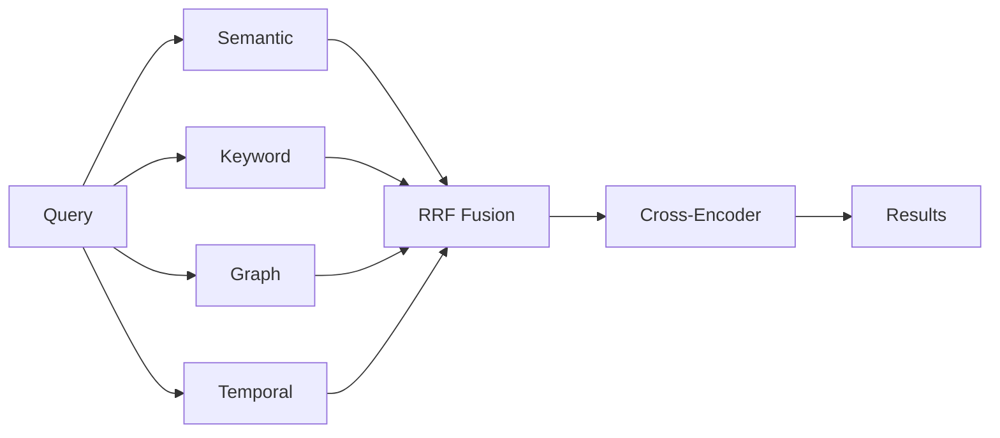
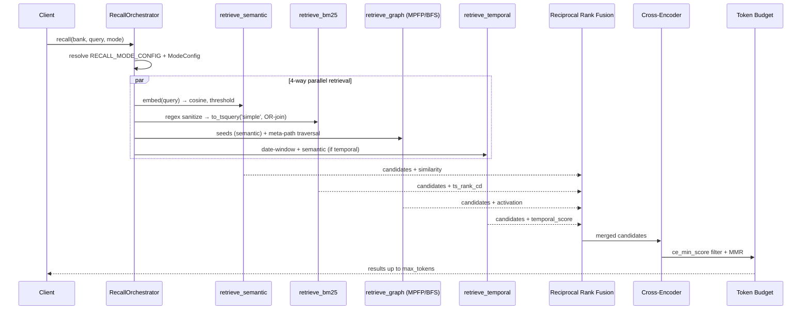

# Recall: How Hindsight Retrieves Memories

When you call `recall()`, Hindsight uses multiple search strategies in parallel to find the most relevant memories, regardless of how you phrase your query.



---

## The Challenge of Memory Recall

Different queries need different search approaches:

- **"Alice works at Google"** → needs exact name matching
- **"Where does Alice work?"** → needs semantic understanding
- **"What did Alice do last spring?"** → needs temporal reasoning
- **"Why did Alice leave?"** → needs causal relationship tracing

No single search method handles all these well. Hindsight solves this with **TEMPR** — four complementary strategies that run in parallel.

---

## Four Search Strategies

### Semantic Search

**What it does:** Understands the *meaning* behind words, not just the words themselves.

**Best for:**
- Conceptual matches: "Alice's job" → "Alice works as a software engineer"
- Paraphrasing: "Bob's expertise" → "Bob specializes in machine learning"
- Synonyms: "meeting" matches "conference", "discussion", "gathering"

**Why it matters:** You can ask questions naturally without matching exact keywords.

---

### Keyword Search

**What it does:** Finds exact terms and names, even when they're spelled uniquely.

**Best for:**
- Proper nouns: "Google", "Alice Chen", "MIT"
- Technical terms: "PostgreSQL", "HNSW", "TensorFlow"
- Unique identifiers: URLs, product names, specific phrases

**Why it matters:** Ensures you never miss results that mention specific names or terms, even if they're semantically distant from your query.

---

### Graph Traversal

**What it does:** Follows connections between entities to find indirectly related information.

**Best for:**
- Indirect relationships: "What does Alice do?" → Alice → Google → Google's products
- Entity exploration: "Bob's colleagues" → Bob → co-workers → shared projects
- Multi-hop reasoning: "Alice's team's achievements"

**Why it matters:** Retrieves facts that aren't semantically or lexically similar but are **structurally connected** through the knowledge graph.

**Example:** Even if Alice and her manager are never mentioned together, graph traversal can find the manager through shared projects or team relationships.

---

### Temporal Search

**What it does:** Understands time expressions and filters by when events occurred.

**Best for:**
- Historical queries: "What did Alice do in 2023?"
- Time ranges: "What happened last spring?"
- Relative time: "What did Bob work on last year?"
- Before/after: "What happened before Alice joined Google?"

**How it works:** Combines semantic understanding with time filtering to find events within specific periods.

**Why it matters:** Enables precise historical queries without losing old information.

---

## Result Fusion

After the four strategies run, results are **fused together**:

- Memories appearing in **multiple strategies** rank higher (consensus)
- **Rank matters more than score** (robust across different scoring systems)
- Final results are **re-ranked** using a neural model that considers query-memory interaction

**Why fusion matters:** A fact that's both semantically similar AND mentions the right entity will rank higher than one that's only semantically similar.

---

## Why Multiple Strategies?

Consider the query: **"What did Alice think about Python last spring?"**

- **Semantic** finds facts about Alice's opinions on programming
- **Keyword** ensures "Python" is actually mentioned
- **Graph** connects Alice → opinions → programming languages
- **Temporal** filters to "last spring" timeframe

The **fusion** of all four gives you exactly what you're looking for, even though no single strategy would suffice.

---

## Token Budget Management

Hindsight is built for AI agents, not humans. Traditional search systems return "top-k" results, but agents don't think in terms of result counts—they think in tokens. An agent's context window is measured in tokens, and that's exactly how Hindsight measures results.

**How it works:**
- Top-ranked memories selected first
- Stops when token budget is exhausted
- You specify context budget, Hindsight fills it with the most relevant memories

**Parameters you control:**
- `max_tokens`: How much memory content to return (default: 4096 tokens)
- `budget`: Search depth level (low, mid, high)
- `fact_type`: Filter by world, experience, opinion, or all

### Expanding Context: Chunks and Entity Observations

Memories are distilled facts—concise but sometimes missing nuance. When your agent needs deeper context, you can optionally retrieve the source material and related knowledge:

| Option | Parameters | When to Use |
|--------|------------|-------------|
| **Chunks** | `include_chunks`, `max_chunk_tokens` | Need exact quotes, original phrasing, or surrounding context |
| **Entity Observations** | `include_entities`, `max_entity_tokens` | Need broader knowledge about people/things mentioned in results |

**Chunks** return the raw text that generated each memory—useful when the distilled fact loses important nuance:

```
Memory: "Alice prefers Python over JavaScript"
Chunk:  "Alice mentioned she prefers Python over JavaScript, mainly because
         of its data science ecosystem, though she admits JS is better for
         frontend work and she's been learning TypeScript lately."
```

**Entity Observations** pull in related facts about entities mentioned in your results. If a memory mentions "Alice", you automatically get her role, skills, and other relevant context—without needing a separate query:

```
Query: "What programming languages does Alice like?"
Memory: "Alice prefers Python over JavaScript"
Entity Observations (Alice):
  - "Alice is a senior data scientist at Google"
  - "Alice specializes in machine learning"
  - "Alice has been learning TypeScript"
```

**When to include them:**
- **Chunks**: When generating responses that need verbatim quotes or when context matters (e.g., "What exactly did Alice say about the project?")
- **Entity Observations**: When building complete profiles or when the conversation might reference multiple aspects of an entity (e.g., "Tell me about Alice's work")

Each has its own token budget, giving you precise control over total context size.

---

## Tuning Recall: Quality vs Latency

Different use cases require different trade-offs between **recall quality** and **response speed**. Two parameters control this:

### Budget: Search Depth

Controls how thoroughly Hindsight explores the memory bank—affecting graph traversal depth, candidate pool size, and cross-encoder re-ranking:

| Budget | Best For | Trade-off |
|--------|----------|-----------|
| **low** | Quick lookups, simple queries | Fast, may miss indirect connections |
| **mid** | Most queries, balanced | Good coverage, reasonable speed |
| **high** | Complex queries requiring deep exploration | Thorough, slower |

**Example:** "What did Alice's manager's team work on?" benefits from high budget to traverse multiple hops (Alice → manager → team → projects) and evaluate more candidates.

### Max Tokens: Context Window Size

Controls how much memory content to return:

| Max Tokens | ~Pages of Text | Best For | Trade-off |
|------------|----------------|----------|-----------|
| **2048** | ~2 pages | Focused answers, fast LLM | Fewer memories, faster |
| **4096** (default) | ~4 pages | Balanced context | Good coverage, standard |
| **8192** | ~8 pages | Comprehensive context | More memories, slower LLM |

**Example:** "Summarize everything about Alice" benefits from higher max_tokens to include more facts.

### Two Independent Dimensions

Budget and max_tokens control different aspects of recall:

| Parameter | What it controls | Latency impact | Example |
|-----------|------------------|----------------|---------|
| **Budget** | How thoroughly to explore memories | Search time | High budget finds Alice → manager → team → projects |
| **Max Tokens** | How much context to return | LLM processing time | High tokens returns more memories to the agent |

**They're independent.** Common combinations:

| Budget | Max Tokens | Use Case |
|--------|------------|----------|
| high | low | Deep search, return only the best results |
| low | high | Quick search, return everything found |
| high | high | Comprehensive research queries |
| low | low | Fast chatbot responses |

### Recommended Configurations

| Use Case | Budget | Max Tokens | Why |
|----------|--------|------------|-----|
| **Chatbot replies** | low | 2048 | Fast responses, focused context |
| **Document Q&A** | mid | 4096 | Balanced coverage and speed |
| **Research queries** | high | 8192 | Comprehensive, multi-hop reasoning |
| **Real-time search** | low | 2048 | Minimize latency |

---

## Graph Retrieval Algorithms

Hindsight supports two graph traversal algorithms, each optimized for different scenarios:

| Algorithm | Default | Best For | Complexity |
|-----------|---------|----------|------------|
| **MPFP** | ✓ | Large graphs, production | O(P × H × F × K) |
| **BFS** | | Small graphs, debugging | O(V + E) |

### MPFP (Meta-Path Forward Push)

A sublinear graph traversal algorithm that follows predefined meta-paths (patterns of edge types) using lazy edge loading.

**How it works:**
1. Starts from semantic entry points (top similar facts)
2. Follows multiple meta-path patterns in parallel:
   - `semantic → semantic` (topic expansion)
   - `entity → temporal` (entity timeline)
   - `semantic → causes` (causal reasoning)
   - `entity → semantic` (entity context)
3. Loads edges lazily per hop, only for active frontier nodes
4. Fuses results from all patterns via Reciprocal Rank Fusion (RRF)

**Complexity:** O(P × H × F × K) where P = patterns (~7), H = hops (2), F = frontier size (~20-100), K = neighbors per node (20).

**Use case:** Production workloads with large memory banks (10k+ facts). Only loads the edges it needs, avoiding full graph scans.

### BFS (Breadth-First Spreading Activation)

Classic spreading activation that propagates relevance scores through the graph using breadth-first traversal.

**How it works:**
1. Starts from semantic entry points with initial activation scores
2. Spreads activation to neighbors with decay (α = 0.8 per hop)
3. Boosts causal links (causes, enables, prevents)
4. Continues until budget exhausted or activation below threshold

**Complexity:** O(V + E) where V and E are visited nodes and edges, bounded by budget.

**Use case:** Small memory banks, debugging, or when you need to understand exactly how results were found.

---

## Pipeline & Modes (As Implemented)

This section documents **what the code actually does today** (file references are authoritative). It complements the higher-level narrative above and flags gaps against the Engram concept in `11_retrieval_architecture.md`.

### End-to-End Flow

Entry point: `RecallOrchestrator.recall_async()` in `hindsight-api/hindsight_api/engine/recall_orchestrator.py`.



### `RECALL_MODE_CONFIG` (runtime thresholds)

Defined at `engine/recall_orchestrator.py:67`. Controls retriever behavior and reranker cutoff:

| Mode | `similarity_threshold` | `ce_min_score` | `max_results` | `max_tokens` |
|---|---|---|---|---|
| `precision` | 0.7 | 0.05 | 3 | 1024 |
| `validation` | 0.6 | 0.03 | 5 | 2048 |
| `analogy` | 0.5 | 0.02 | 5 | 2048 |
| `exploration` | 0.5 | 0.01 | 10 | 2048 |

> **Why `ce_min_score` is so low**: the multilingual `cross-encoder/mmarco-mMiniLMv2-L12-H384-v1` produces absolute scores in `[0.0, 0.5]` for relevant matches — substantially lower than the English-only `ms-marco` model it replaced. `precision=0.05` was calibrated empirically to filter cross-topic noise (CE ≈ 0.0) while letting borderline-relevant German matches through (CE ≈ 0.05–0.15). See the comment block at `recall_orchestrator.py:59-66`.

### `ModeConfig` (scoring & traversal profile)

A second, orthogonal profile at `engine/session/mode_config.py` drives scoring weights, graph depth, reconsolidation behavior, and `strength_pre_filter` between RRF and CE:

| Mode | `strength_pre_filter` | `traversal_depth` | Weights (`ce / rrf / thalamus`) |
|---|---|---|---|
| `precision` | 0.05 | shallow | 0.60 / 0.15 / 0.10 |
| `exploration` | 0.0 | deep | 0.20 / 0.15 / 0.30 |
| `analogy` | 0.05 | medium | 0.30 / 0.25 / 0.25 |
| `validation` | 0.1 | medium | 0.35 / 0.10 / 0.30 |

The `strength_pre_filter` was intentionally lowered from 0.3–0.5 to 0.05–0.1 so that fresh buffer engrams (`strength ≈ 0.1`) are not silently discarded before reranking. See `mode_config.py:174-182`.

### BM25 Tokenization

Two layers, both language-agnostic by design:

**Stored side** (`alembic/versions/c1d2e3f4a5b6_bm25_simple_config.py`):

```sql
search_vector GENERATED ALWAYS AS (
    to_tsvector('simple', COALESCE(text,'') || ' ' || COALESCE(context,''))
) STORED
```

- `simple` config: lowercase + split on whitespace/punctuation.
- **No stemming**, **no stopword filter** — deliberate. English stemming mangled German (`Festplattenausfall` → `festplattenausfal`).
- Trade-off: morphological variants (`Datenbank` / `Datenbanken`) must be caught by semantic search, not BM25.

**Query side** (`engine/search/retrieval.py:134-149`):

```python
sanitized_text = re.sub(r"[^\w\s]", " ", query_text.lower())
tokens = [t for t in sanitized_text.split() if t]
query_tsquery = " | ".join(tokens)   # OR — not AND
```

- Special chars dropped (hyphens, apostrophes, quotes, punctuation).
- Tokens are **OR-joined**, so any single matching token scores via `ts_rank_cd`.
- There is **no BM25 score threshold** — everything that matches the tsquery survives to RRF.

### Filter Chain (hard cuts)

1. **Semantic**: `1 - cosine_distance >= similarity_threshold` (hard cut, mode-dependent).
2. **RRF merge**: rank-based (k=60), no cut.
3. **`strength_pre_filter`** (`mode_config.py`): drops engrams below the mode's minimum strength *before* the cross-encoder spends compute.
4. **Cross-encoder**: `score >= ce_min_score` (hard cut, mode-dependent).
5. **MMR**: diversity rerank, no cut.
6. **Token budget**: `max_tokens` stops iteration; `max_results` caps count.

Any stage can eliminate a candidate silently. That matters for diagnosis: a missing result could be blocked at (1), (3), (4), or never enter the candidate set at all.

### Concept vs. Implementation — Known Gaps

`11_retrieval_architecture.md` prescribes behavior that the current code does not fully deliver:

| Concept says | Code does | Impact |
|---|---|---|
| "High weight on **Context Tag Overlap**" for Precision mode | Tags in `engram_dictionary.tags` only **filter** (AND-match) — they never contribute to scoring | Verbatim keyword-overlap alone cannot rescue a retrieval when semantic similarity and CE both score low |
| "Exact Engram match" for Precision | No exact-match short-circuit. All queries go through `semantic ∪ BM25 ∪ graph ∪ temporal → RRF → CE` | A stored fact containing the query keywords may still be dropped by the CE threshold |
| Pattern Completion (CA3) vs. Separation (DG) | No distinct mechanism; mode differences are purely threshold/weight tweaks on a single pipeline | Exploration is broader, but does not use a genuinely different retrieval path |
| Schema Prediction Match as Medium-weight scoring term | Not wired into the recall scoring formula (schemas exist in Neo4j but aren't queried during recall) | Schema-driven priors are unavailable at retrieval time |

These gaps explain some failure modes that look like "recall just doesn't work" — particularly for short, single-token queries against long multilingual engrams, where semantic and CE both score near zero and BM25 alone isn't enough to save the result.

### Diagnostic Checklist

When a recall returns empty despite the fact being stored:

1. **Is the engram in the right bank?** `SELECT id, left(text,120) FROM memory_units WHERE bank_id=$1 AND text ILIKE '%keyword%'`.
2. **Does the stored tsvector contain the query tokens?** `SELECT to_tsvector('simple', text || ' ' || COALESCE(context,'')) FROM memory_units WHERE id=$1`.
3. **Does BM25 alone find it?** Run the query from `retrieve_bm25` directly against the DB.
4. **What is the top-10 semantic similarity without a threshold?** Confirms whether mode threshold is too strict.
5. **What does the cross-encoder actually score this pair?** Often the silent killer for short queries vs. long text.
6. **Enable `enable_trace=True`** on `recall_async` to see which stage dropped the candidate.

---

## Next Steps

- [**Retain**](./retain) — How memories are stored with rich context
- [**Reflect**](./reflect) — How disposition influences reasoning
